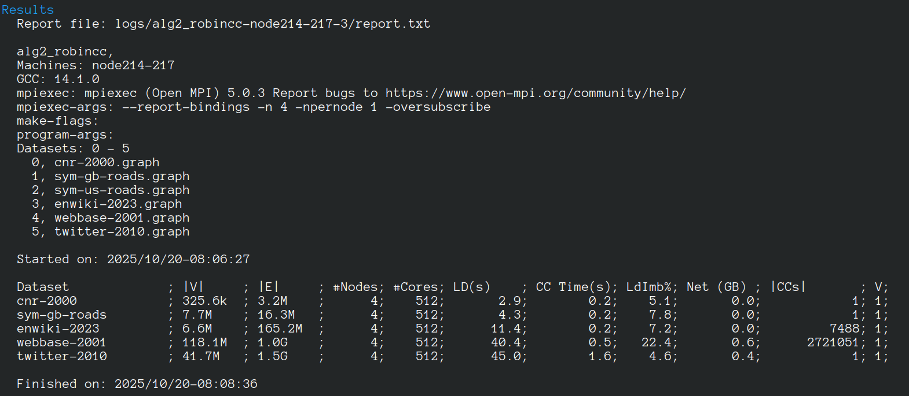

# [SiPaR-SiskinCC-RobinCC]()

This repository contains the source code of SiskinCC and RobinCC, distributed Connected Components algorithms. 
The source code uses MPI and OpenMP. The implementation incorporates some  components from the [LaganLighter](https://github.com/MohsenKoohi/LaganLighter/).

### Paper
[On Optimizing Resource Utilization in Distributed Connected Components](https://doi.org/10.48550/arXiv.2507.03695)

### Cloning 
`git clone https://github.com/MohsenKoohi/SiPaR-SiskinCC-RobinCC.git --recursive`

### Updating through `pull`
- `git pull --recurse-submodules` or
- You may set recursive submodule update globally using `git config --global submodule.recurse true` and then `git pull` fetches all updates.

### Requirements (Linux)
1. Libraries: `mpi`, `openmp`, and `libnuma`
2. Compiler: `gcc` with a version greater than 9 are required.
3. For using ParaGrapher: `JDK` with a version greater than 15 and `libfuse`.
4. `unzip`, `bc`,  and `wget`.

### Compiling and Executing Code
 - Make sure the requried libraries are accessible through `$LD_LIBRARY_PATH`.
 - Allocating machines in SLURM:
   - Interactive allocation:
     - Mainly used for development and/or executing a single dataset.
     - A sample execution of algirthms for [cnr-2000](http://data.law.di.unimi.it/webdata/cnr-2000/) in WebGraph format:
     - `salloc  -p partition  -N number_of_machines  --exclusive  -t max_exec_time --mem 0`
     - `make siskincc_sample` 
     - `make robincc_sample`
   - Batch allocation:
     - Mainly used for processing a set of datasets.
     - `salloc  -p partition  -N number_of_machines  --exclusive  -t max_exec_time --mem 0  ./launcher.sh alg=alg0_siskincc  -df=/path/to/data-folders`
     - `salloc  -p partition  -N number_of_machines  --exclusive  -t max_exec_time --mem 0  ./launcher.sh alg=alg1_robincc  -df=/path/to/data-folders`
     - An example:  

### Supported Graph Types & Loading Graphs
 - [CompBin format](https://doi.org/10.48550/arXiv.2507.00716), using [WG2CompBin library](https://github.com/MohsenKoohi/WG2CompBin), and 
 - [WebGraph format](https://webgraph.di.unimi.it/), using [ParaGrapher library](https://github.com/MohsenKoohi/ParaGrapher) .

Please refer to [Graph Loading Documentation](docs/0.2-loading.md).

### Evaluating a Number of Graph Datasets

Please refer to [Launcher Script Documentaion](docs/0.3-launcher.md).

### Documentation
**[docs/readme.md](docs/readme.md)**

### Citation
```
@article{SiskinCC_RobinCC,
 title={On Optimizing Resource Utilization in Distributed Connected Components}, 
 author=Mohsen {Koohi Esfahani},
 year={2025},
 eprint={2507.03695},
 archivePrefix={arXiv},
 url={https://arxiv.org/abs/2507.03695},
 doi={10.48550/arXiv.2507.03695}
}
```

### Bugs & Support

If you receive wrong results or you are suspicious about parts of the code, 
please [contact us](https://orcid.org/0000-0002-7465-8003).

### License

This program is free software: you can redistribute it and/or modify it under the terms of the GNU General Public License as published by the Free Software Foundation, 
either version 3 of the License, or (at your option) any later version. This program is distributed in the hope that it will be useful, but WITHOUT ANY WARRANTY; 
without even the implied warranty of MERCHANTABILITY or FITNESS FOR A PARTICULAR PURPOSE. See the GNU General Public License for more details.
You should have received a copy of the GNU General Public License along with this program. If not, see <http://www.gnu.org/licenses/>.

#### Copyright ©  2025, Mohsen Koohi Esfahani
